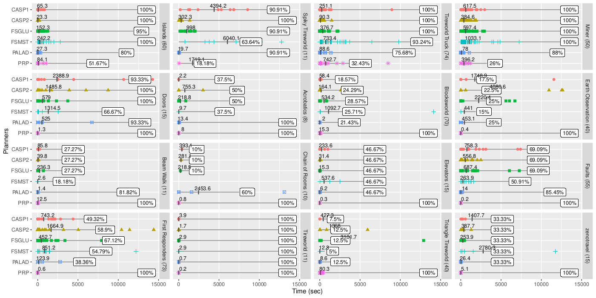

# Time-Coverage Integrated Plots

This repo contains R and Python code to produce **time-coverage integrated plots** for planning experiments, as shown in the following paper:

* Nitin Yadav, Sebastian Sardiña: [A Declarative Approach to Compact Controllers for FOND Planning via Answer Set Programming](https://ebooks.iospress.nl/doi/10.3233/FAIA230593). ECAI 2023: 2818-2825



There is one subplot per domain. Each planner shows the coverage % in the domain, and the average time on top of scatter plot of each instance.

## CSV data table files

The script require a CSV file containing the following columns:

* `solver`: name of solver (e.g., planner).
* `domain`: name of domain (e.g., `blocksworld`).
* `status`: integer stating the result of the run, with `1` denoting _solved successfully_.
* `solved`: boolean stating if run was solved.
* `cputime`: time taken.


## 1. Seaborn-based Python plots

Notebook [coverage_plots.ipynb](coverage_plots.ipynb) plot integrated time-coverage plots using [Seaborn](https://seaborn.pydata.org/) Python visualization package.

An example run on [data_stats.csv](data_stats.csv) would be:


## 2. Coverage Plots in R

The same charts can be produced with Nitin's R script [r-plot/plots.R](r-plot/plots.R).

### Setup

The script requires R. In Linux:

```shell
$ sudo apt-install r-core

$ R

R version 4.1.2 (2021-11-01) -- "Bird Hippie"
Copyright (C) 2021 The R Foundation for Statistical Computing
Platform: x86_64-pc-linux-gnu (64-bit)

R is free software and comes with ABSOLUTELY NO WARRANTY.
You are welcome to redistribute it under certain conditions.
Type 'license()' or 'licence()' for distribution details.

  Natural language support but running in an English locale

R is a collaborative project with many contributors.
Type 'contributors()' for more information and
'citation()' on how to cite R or R packages in publications.

Type 'demo()' for some demos, 'help()' for on-line help, or
'help.start()' for an HTML browser interface to help.
Type 'q()' to quit R.

> sessionInfo()
R version 4.1.2 (2021-11-01)
Platform: x86_64-pc-linux-gnu (64-bit)
Running under: Ubuntu 22.04.4 LTS

Matrix products: default
BLAS:   /usr/lib/x86_64-linux-gnu/blas/libblas.so.3.10.0
LAPACK: /usr/lib/x86_64-linux-gnu/lapack/liblapack.so.3.10.0

locale:
 [1] LC_CTYPE=en_AU.UTF-8       LC_NUMERIC=C
 [3] LC_TIME=en_AU.UTF-8        LC_COLLATE=en_AU.UTF-8
 [5] LC_MONETARY=en_AU.UTF-8    LC_MESSAGES=en_AU.UTF-8
 [7] LC_PAPER=en_AU.UTF-8       LC_NAME=C
 [9] LC_ADDRESS=C               LC_TELEPHONE=C
[11] LC_MEASUREMENT=en_AU.UTF-8 LC_IDENTIFICATION=C

attached base packages:
[1] stats     graphics  grDevices utils     datasets  methods   base

loaded via a namespace (and not attached):
[1] compiler_4.1.2
```

Then, install R-packages [dplyr](https://dplyr.tidyverse.org/) and [ggplot2](https://ggplot2.tidyverse.org/) packages. You can do this from command line once:

```shell
$ mkdir ~/R     # create user home for R's packages
$ export R_LIBS=$HOME/R     # install packages at user level
$ Rscript -e 'install.packages("dplyr")'
$ Rscript -e 'install.packages("ggplot2")'
```

### Generating plots

First, state the file to read from in `plot.R` line as well as other configuration parameters under the `CONSTANT` section:

```R
######################################
#### SET YOUR CONSTANTS
######################################
main_file <- "data_stats"

plot_width <- 15
plot_height <- 12
plot_dpi <- 300
```

Then, you can use [RStudio](https://posit.co/download/rstudio-desktop/) or simply run from command line:

```shell
$ R < plots.R --no-save
```

This should produce a PDF file and a PNG file with the plots.
